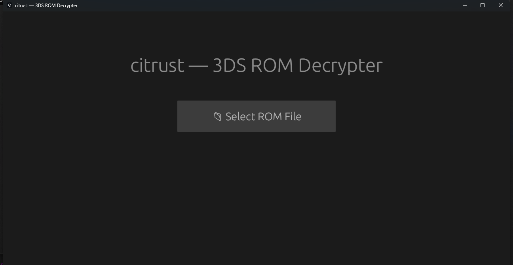

# citrust

[](https://github.com/londospark/citrust/actions/workflows/ci.yml)
[](https://github.com/londospark/citrust/releases)

A fast 3DS ROM decryption tool, written in Rust. Drop-in replacement for [b3DSDecrypt.py](https://github.com/b1k/b3DS) — roughly **4× faster**.

---

## ✨ Features

- **Decrypts .3ds ROM files in-place** — no extra disk space needed
- **All encryption methods supported:** Original (KeyX 0x2C), Key7x (0x25), Key93 (0x18), Key96 (0x1B)
- **Hardware-accelerated AES** — automatic AES-NI detection, zero configuration
- **Memory-mapped I/O** with zero-copy decryption
- **Parallel decryption** across all CPU cores
- **CLI** for scripting and automation
- **GUI** with a SteamOS-friendly design (large buttons, dark theme, Steam Deck resolution)

## 🚀 Performance

| ROM Size | Python (b3DSDecrypt) | citrust | Speedup |
|----------|----------------------|---------|---------|
| 1.84 GB  | 4.73 s               | 1.16 s  | **4.1×** |

## 📸 GUI



Launch `citrust-gui`, click **Select ROM File**, click **Decrypt** — done.

## 📥 Installation

### Download (recommended)

Grab the latest release for your platform:

👉 **[GitHub Releases](https://github.com/londospark/citrust/releases)** — Linux and Windows binaries available.

### Build from source

```sh
git clone https://github.com/londospark/citrust.git
cd citrust
cargo build --release -p citrust-cli    # CLI only
cargo build --release -p citrust-gui    # GUI (needs a display server)
```

Requires **Rust 1.85+** and an **x86_64** CPU (AES-NI recommended for full performance).

## 🔧 Usage

### CLI

```sh
citrust path/to/rom.3ds
```

That's it. The ROM is decrypted in-place. citrust auto-detects the encryption method and handles everything.

### GUI

1. Launch `citrust-gui`
2. Click **Select ROM File**
3. Click **Decrypt**
4. Done

## 🏗️ Architecture

citrust is a Cargo workspace with three crates:

| Crate | Type | Description |
|-------|------|-------------|
| `citrust-core` | Library | Crypto, ROM parsing, decryption logic |
| `citrust-cli` | Binary | Command-line interface |
| `citrust-gui` | Binary | GUI application (egui/eframe) |

## 🙏 Credits

- Original Python decryption tool: [b3DS](https://github.com/b1k/b3DS) by b1k
- AI team management: [Squad](https://github.com/bradygaster/squad) by Brady Gaster
